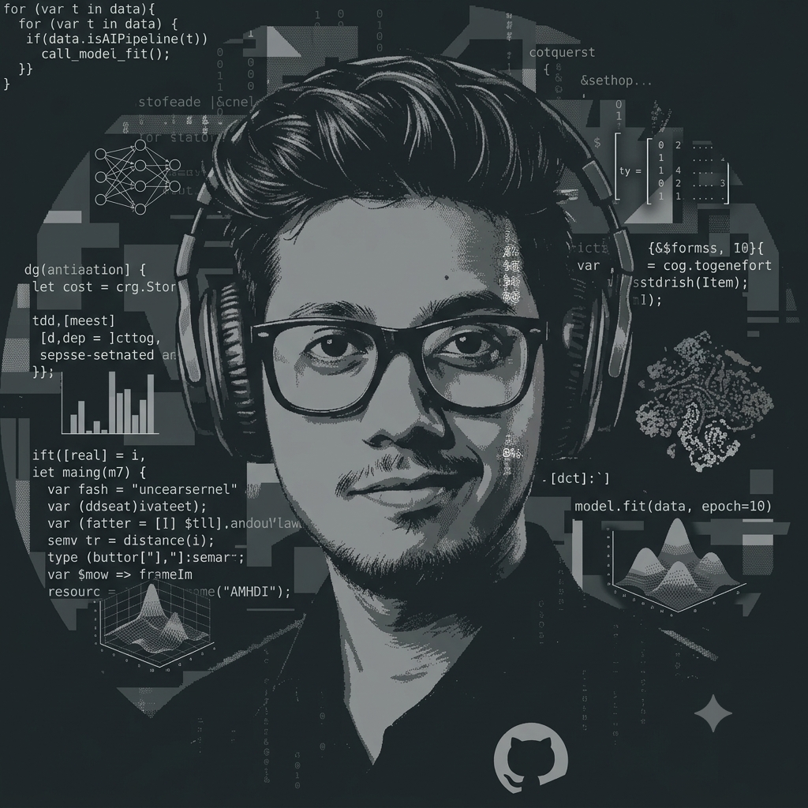

  
  
  # Kiriti Ray Choudhury 👋
  ### Senior Data Scientist & Generative AI Systems Architect
  
  🌐 Gurugram, India • 📧 raychoudhurykiriti@gmail.com • 💼 [LinkedIn Profile](https://linkedin.com/in/kiriti-ray-choudhury)[span_0](start_span)[span_0](end_span)
  
  ---

## 🧠 About Me
I am a Full-Stack Data Scientist and AI Developer focused on bridging heavy statistical engineering with production-grade Generative AI systems[span_1](start_span)[span_1](end_span). I design and build end-to-end autonomous frameworks—ranging from multi-agent orchestration engines to deep reinforcement learning loops and custom computer vision architectures—that deliver definitive enterprise value[span_2](start_span)[span_2](end_span).

---

## 🛠️ Technical Ecosystem

| Category | Frameworks & Tools |
| :--- | :--- |
| **GenAI & Agents** | Transformers (MoE), GPTs, Claude, Gemini, Llama, LangGraph, AutoGen, RAG, GraphRAG, CoT, ReAct[span_3](start_span)[span_3](end_span) |
| **ML & Deep Learning** | PyTorch, TensorFlow, XGBoost, LightGBM, CatBoost, CNNs (ResNet, EfficientNet), LSTMs, BERT, RoBERTa[span_4](start_span)[span_4](end_span) |
| **Vector Space & Ops** | Pinecone, OpenSearch, FAISS, LangSmith, MLflow, W&B, Docker, CI/CD (GitHub Actions, Azure DevOps)[span_5](start_span)[span_5](end_span) |
| **Cloud & Deployment** | AWS (Bedrock, SageMaker, Lambda), Azure (OpenAI Service, AI Search), GCP (Vertex AI), Databricks, FastAPI[span_6](start_span)[span_6](end_span) |

---

## 🚀 Core Engineering Milestones

*   **Agentic Systems & STP Engines:** Architected an AI-driven Straight Through Process (STP) engine to automate unstructured financial amortization notes using **Bedrock Sonnet 3.5**, **LangGraph**, and **AutoGen** for real-time code generation[span_7](start_span)[span_7](end_span).
*   **Market Risk Predictive Modeling:** Developed a multi-label **XGBoost + Classifier Chain** solution predicting activist investor activity for 1,200+ corporations before SEC filings, securing a 5x prediction lift[span_8](start_span)[span_8](end_span).
*   **High-Fidelity Document Intelligence:** Engineered extraction pipelines utilizing hybrid chunking strategies (hierarchical + semantic) for credit agreements yielding a **0.82 RAGAS score**, alongside OCR-based **HyDE** prompt extractors using **Gemini Flash**[span_9](start_span)[span_9](end_span).
*   **Mathematical Optimization & Twins:** Designed digital twin production frameworks using **Google OR-Tools** and **Gurobi (MIP)** to handle complex non-linear constraints, slashing capital expenses by 20%[span_10](start_span)[span_10](end_span).
*   **Deep Reinforcement Learning & IoT:** Utilized **Proximal Policy Optimization (PPO)** for real-time asset mix decisions (15% clean energy gain) and deployed **XGBoost + LSTM** ensembles over high-frequency IoT sensor data to drop asset downtime by 30%[span_11](start_span)[span_11](end_span).
*   **Computer Vision & Neural Networks:** Deployed a custom **Faster R-CNN** framework on industrial drone imagery achieving a **0.95 mAP** for automated defect detection, alongside building **Siamese LSTM** networks for semantic sequence duplicate search[span_12](start_span)[span_12](end_span).

---

## 🏆 Selected Achievements

*   **Enterprise Rising Star Award (Q4 2025):** Awarded for key breakthroughs in high-impact multi-agent orchestration and data extraction pipelines[span_13](start_span)[span_13](end_span).
*   **Double Employee of the Month Recognition:** Honored twice for executing and deploying complex production AI architectures well ahead of aggressive timelines[span_14](start_span)[span_14](end_span).
*   **Academic Foundation:** B.Tech in Electrical Engineering from National Institute of Technology (NIT), Silchar[span_15](start_span)[span_15](end_span).
